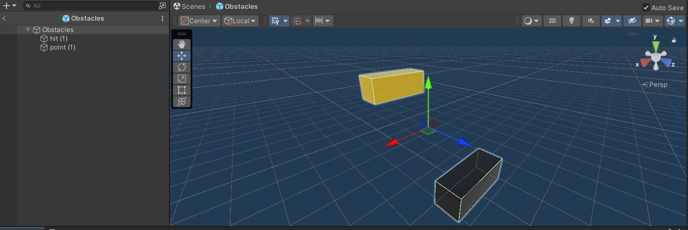

# JUMPER OEFENING

## 1. Install MLagents

Voeg MLagents toe vanuit de unity package manager:

## 2. Scene setup

Voor we de objecten in onze scene gaan zetten voegen we 4 tags toe:

Vervolgens voegen we 1 plane object, 1 cube (genaamd agent) 1 wall waar de mesh van wordt uitgezet en 1 empty object die je aan de andere kan van de plane plaats t.o.v. de wall. Het moet er ongeveer als volgt uitzien:

Voeg dan ook de tag wall aan de wall toe en de ground tag aan de plane.

Maak daarna een prefab die de obstacels zullen voorstellen:

Belangrijk hierbij is dat de gele balk de point tag moet krijgen en de zwarte balk de tag hit. Ook zijn deze 2 child objects van 1 empty object.

Nu moeten de objecten nog de juiste componeneten krijgen, hieronder staan screenshots van welke componenten elk object moet hebben. Belangrijk is dat de scripts die nog niet bestaan zelf gemaakt moeten worden. De inhoud van de scripts volgt later (als er geen screenshot van het object staat moet er niets special mee gedaan worden).

### Agent

### Wall

### Hit & Point

### Parent van Hit & Point

## 3. Scripts

In dit stuk zal er getoond worden welke script er gebruikt worden met een korte uitleg hoe ze werken.

### CubeAgentRays

Voor we beggin pas MonoBehaviour naar Agent (bovenaan het script)!

Dit zijn de variable die we nodig hebben doorheen ons script:
 - jump is voor te tracken of de agent op de grond staan en dus kan jumpen of niet
 - rb wordt gebruikt om de agent zijn rigidbody3d in te slepen (zie punt 2 agent)
 - jumpForce bepaalt de sprongkracht
 - prefabToSpawn moet de prefab obstacles bevatten die we eerder hebben gemaakt

 
Dit stukje script wordt geruned bij het begin van elke episode. Hier zetten we de jump op true, zetten we de agent terug op zijn oorspornkelijke positie (inclusief rotation). Ook zetten we de locatie waar het eerste obstacel gaat spawnen en spawnen we dit vervolgens dan ook.

Hier voegen we de enige observatie toe die we nodig hebben namelijk de positie van de agent.

Hier zeggen we welke acties de agent kan verichten in ons gevel is dat enkel springen. Belangrijk hier is dat wordt gekeken of de agent ook werkelijk kan jumpen.

Hier wordt de logica voor het puntensysteem toegevoegd. Als de agent in collision komt met de tag "hit" (dus de zwarte balk) dam krijgt het -1 als reward. Als het de point tag hit (gele balk) dan krijgt het +1. Als het in contact is met "ground" dan kan de agent springen.

Dit laatste stukje is niet noodzakelijk maar is handig als je de agent handmatig wilt uitproberen.

### MovingForward

Dit is een heel eenvoudig script waar er een random getal wordt gepakt in de range tusse min en max speed. Vervolgens beweegt het object waar dit script op hangt aan een constante snelheid naar voor.

### DeleteObstacles

Dit script zorgt ervoor dat het obstacel verwijderd en gerespawned wordt als de agent erover springt. Het object wordt enkel gerespawned al het om tag "hit" gaat.

## Conclusie
Dit is alles wat er nodig is om dit project op te bouwen. Vervolgens kan je MLagents starten en beginnen met trainen, of het zeer kort getrainde model van deze github pagina gebruiken.